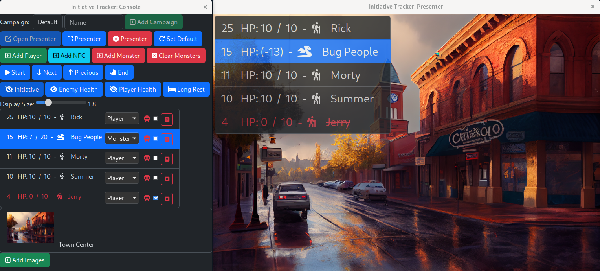

#  Initiative Tracker

Track initiative for your campaigns on a secondary monitor.

* Track initiative of players, monsters and NPCs
* Track players, monsters and NPCs health
* Display images to set the scene of the locations your players explore.
* Persist state of the game.
* Quickly switch between multiple campaigns easily.




## Development

1. Install [asdf](https://asdf-vm.com/).
2. Install tools
```bash
asdf install
```
3. Install dependencies
```bash
yarn install
```
4. Run development
```bash
yarn tauri dev
```
