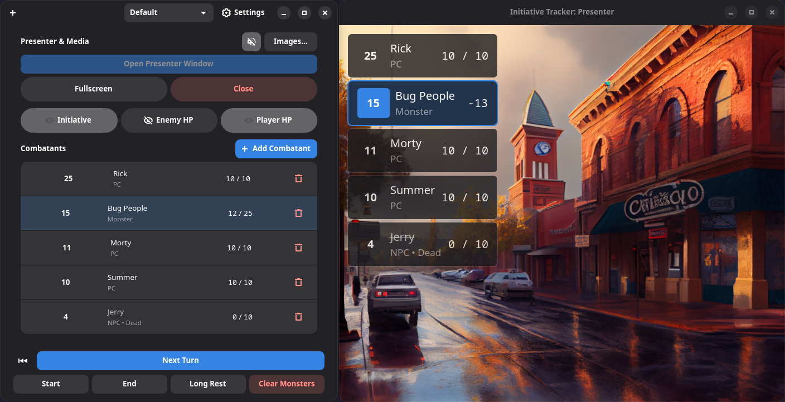

# Initiative Tracker

GTK4 / libadwaita app for tabletop RPG combat. You run the fight from the Console. Players watch the Presenter window.



Application id: `im.apodaca.InitiativeTracker`  
Binary: `initiative-tracker-gtk`

Targets GNOME 50 (GTK 4.22+, libadwaita 1.9+).

## Native build (Meson + Cargo)

Distro packages (names vary): Rust toolchain, GTK 4.22+, libadwaita 1.9+, Meson, Ninja, Blueprint compiler, `desktop-file-utils`, `appstreamcli` (optional validation).

```bash
meson setup build
meson compile -C build
./build/src/initiative-tracker-gtk
```

Local install:

```bash
meson setup build --prefix=$HOME/.local
meson install -C build
initiative-tracker-gtk
```

Cargo-only (same binary, skips desktop/metainfo install):

```bash
cargo test
cargo run
```

## Flatpak (GNOME 50)

Needs `flatpak`, `flatpak-builder`, and the GNOME 50 SDK:

```bash
flatpak install --user flathub org.gnome.Sdk//50 org.gnome.Platform//50 \
  org.freedesktop.Sdk.Extension.rust-stable//25.08
```

From the repository root:

```bash
flatpak-builder --user --install --force-clean packaging/flatpak/build-dir \
  packaging/flatpak/im.apodaca.InitiativeTracker.json
flatpak run im.apodaca.InitiativeTracker
```

The sandbox does not grant home or Pictures access. Add Images uses `GtkFileDialog` (document portal) and copies selected files into `$XDG_DATA_HOME/im.apodaca.InitiativeTracker/images/` so Presenter thumbnails survive a restart.

## AppImage

Built against Ubuntu 26.04-class GTK. From `packaging/appimage`:

```bash
./build.sh
```

That writes `InitiativeTracker-$VERSION-$ARCH.AppImage` in the same directory. `./smoke-docker.sh` builds inside `ubuntu:26.04` the way CI does.

## Arch

From `packaging/arch`:

```bash
makepkg -si
```

The PKGBUILD compiles the git checkout two directories up (this repo root).

## Coming from the old Tauri app

The Svelte/Tauri frontend is gone. If you still have its `.settings.dat` store, the first GTK launch with no `state.json` will import campaigns from it. After that, saves go to `$XDG_DATA_HOME/im.apodaca.InitiativeTracker/state.json`. The old store is never written back.

Image paths that pointed outside the Flatpak sandbox may need to be added again.

## Keyboard shortcuts (Console)

| Shortcut | Action |
|---|---|
| `Ctrl+N` | Next turn |
| `Ctrl+Shift+N` | Previous turn |
| `Ctrl+Shift+P` | Open Presenter |
| `Ctrl+Shift+F` | Toggle Presenter fullscreen |
| `Ctrl+Q` | Quit (saves state) |

Presenter: `F11` toggles fullscreen; `Esc` exits fullscreen.
