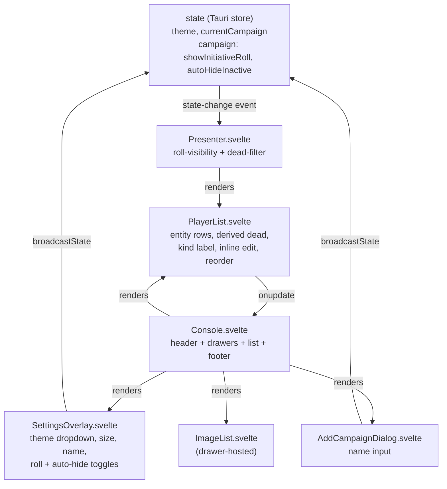

# Console Mockup Redesign - Plan

## Goal Capsule

- **Objective:** Refactor the Console window to match `mockup.html`'s layout and dark color palette, with feature parity to the current app and two new behavior-backed settings.
- **Authority hierarchy:** This plan is the source of truth for the refactor. The mockup is authoritative for layout and palette; the existing app is authoritative for behavior that must be preserved. Where they conflict on behavior, feature parity wins; where they conflict on appearance, the mockup wins.
- **Execution profile:** Single PR, Svelte 5 runes + Tailwind v4 + Tauri 2. No test framework — verification is build plus runtime smoke (`vite preview`, `tauri dev` where the toolchain is available).
- **Stop conditions:** Console renders the mockup's region composition with the mockup palette; light/dark toggle lives in the settings overlay and still works; all pre-existing combat actions are reachable; the two new settings affect the Presenter; `yarn build` passes.
- **Tail ownership:** Implementation handoff is `/ce-work` or `/goal`. No code is written by this plan.

---

## Product Contract

### Summary

Rebuild the Console UI into the mockup's header/drawers/list/sticky-footer layout, swap Tailwind's default palette for the mockup's custom blue/green/red on near-black surfaces, move the light/dark toggle into a settings overlay dropdown, and add two behavior-backed settings — Show Initiative Roll (toggles the roll number on the Presenter) and Auto-Hide Inactive Turns (the Presenter skips dead combatants). Behavior, persistence, and cross-window state sync are preserved; dead state becomes derived from HP.

### Problem Frame

The Console grew as a flat stack of top-of-page buttons. The mockup reorganizes the same controls into a mobile/sidebar console shape: a header bar, collapsible drawers, a compact combatant list, and a sticky action footer. It also introduces a cleaner palette and a settings overlay. The current Tailwind migration already replaced Bootstrap with Tailwind v4 and a system-aware theme toggle, so this refactor builds on that foundation — it is a layout + theming pass, not a stack change. Two gaps the mockup exposes: initiative-roll visibility and dead-combatant hiding are not currently controllable, and the inline kind-changer dropdown clutters the row.

### Requirements

**Layout & structure**

- R1. The Console renders a header bar containing the campaign selector, a small add-campaign button (opens a name dialog), and a settings button.
- R2. The Console renders a scrollable content area with collapsible drawers: a "Presenter & Media" drawer (open-presenter button + the existing image gallery) and an "Add Combatant" drawer (Name, Init Roll, Max HP fields + PC/NPC/Monster add buttons).
- R3. A visibility row exposes three eye-toggle buttons (Initiative, Enemy HP, Player HP) mapping to the existing `initiativeVisible`/`healthVisible`/`enemyHealthVisible` campaign flags.
- R4. The combatant list renders as the mockup's entity rows: an initiative badge, name, a meta label, an HP badge, and a delete control.
- R5. A sticky combat-action footer exposes the prev/next turn actions plus Long Rest and Clear Monsters.

**Feature parity (preserved from the current app)**

- R6. All existing combat actions remain reachable: Start, Next, Previous, End initiative, Long Rest, Clear Monsters, and per-combatant delete.
- R7. Inline click-to-edit for name, initiative, HP, and max HP is preserved, as is drag-to-reorder in non-initiative mode.
- R8. Campaign switching, adding campaigns, and the campaign's persisted state survive across restarts.
- R9. Presenter open, fullscreen, and close actions remain available from the Console; the Presenter still reflects state via the existing `state-change` event.

**Settings overlay**

- R10. A settings overlay modal (opened from the header) holds: a theme dropdown (system/light/dark), a display-size range, a campaign-name field, a Show Initiative Roll checkbox, and an Auto-Hide Inactive Turns checkbox, plus a Save button.
- R11. The theme dropdown replaces the top-bar toggle; preference persists as `state.theme` and syncs to the Presenter exactly as today.

**New behavior-backed settings**

- R12. Show Initiative Roll (campaign-level, default true) toggles whether the initiative roll number renders on the Presenter.
- R13. Auto-Hide Inactive Turns (campaign-level, default false) hides dead combatants on the Presenter.

**Row semantics & palette**

- R14. The per-row kind-changer dropdown is removed; the meta label shows the kind (PC/NPC/Monster) and shows "Dead" when the combatant is dead.
- R15. Dead state is derived from HP: a combatant is dead when `health <= 0` and revives when HP rises above 0. The explicit dead checkbox is removed.
- R16. The mockup's palette replaces Tailwind's defaults in `src/app.css` for both light and dark themes: primary `#4ea8de`, success `#04d361`, danger `#f75a68`, near-black surfaces (`#121214`/`#1a1a1e`/`#26262b`), text `#e1e1e6`/`#a8a8b3`, border `#29292e`. Light theme uses a derived inverted neutral set.

### Scope Boundaries

**In scope:** Console layout, `app.css` palette, settings overlay, add-campaign dialog, PlayerList row restyle, dead-derivation, Presenter honor of the two new settings.

**Out of scope:**

- Pixel-perfect fidelity to the mockup's placeholder images, emoji icons, or exact spacing — the layout shape and palette are the target, not a screenshot match.
- Redesigning the Presenter window's own layout; the Presenter only gains the two new behavior toggles.
- Adding a test framework.
- Renaming or restructuring the state store schema beyond the two new fields and dead-derivation normalization.

#### Deferred to Follow-Up Work

- Replacing the mockup's emoji icons with FontAwesome equivalents consistently across the new layout (the plan preserves FontAwesome where icons already exist; a full icon-audit pass is separate).
- A "system" indicator beyond the dropdown's selected option.
- Light-mode pixel polish for the Presenter beyond what the dark variant already provides.

---

## Planning Contract

### Key Technical Decisions

- **KTD1. Palette via Tailwind v4 `@theme` tokens, not a second stylesheet.** Define the mockup colors as custom tokens in `src/app.css` (`--color-primary`, `--color-success`, `--color-danger`, surface/content/edge neutrals) so `@apply` component classes and utility classes both reference them. This keeps a single source of color truth and lets the existing `@custom-variant dark` drive light/dark without a parallel CSS file. Light theme gets a derived inverted neutral set (light surfaces, dark text) since the mockup specifies dark only.
- **KTD2. Settings overlay and add-campaign dialog as Svelte components, not raw HTML.** Extract `src/components/SettingsOverlay.svelte` and a small `src/components/AddCampaignDialog.svelte` so the Console template stays readable and the overlays are testable in isolation. Both use the existing `state` object and `broadcastState`; neither introduces a new store.
- **KTD3. Dead is derived, not authored.** Stop persisting `dead` as an independent toggle. Compute it from `health <= 0` on health changes and on load (normalize legacy state). Keep `dead` as a field on the player object for compatibility with the Presenter and the existing line-through styling, but set it from the derivation. This removes the checkbox and makes "revive on HP > 0" automatic.
- **KTD4. Combat actions all live in the sticky footer.** The mockup footer shows prev + NEXT TURN + Long Rest + Clear Monsters; Start and End initiative are not in the mockup but must remain reachable (R6). Place all combat actions in the footer — the primary row carries Previous and NEXT TURN; a secondary row carries Start, End, Long Rest, and Clear Monsters — so the footer is the single home for combat control and the mockup's footer shape is preserved as the base.
- **KTD5. Theme dropdown keeps three options.** The user asked to move "light/dark mode" into a settings dropdown; retaining `system` as a third option preserves the existing OS-follow behavior and feature parity. The dropdown defaults to `system` as today.
- **KTD6. Campaign-name field renames the current campaign.** The mockup's "Campaign Name" field edits the current campaign's name. Because campaigns are keyed by name in `state`, renaming rekeys `state[currentCampaign]` to the new name, updates the `campaigns` array, and updates `currentCampaign` in one atomic `broadcastState`. This is the most intuitive meaning of "Campaign Name" in settings; the rekey is the edge case to handle carefully.

### High-Level Technical Design

The refactor touches four surfaces that share one state object and one event channel:

State flow is unchanged at the edges: the Console owns `state`, calls `broadcastState` (which `setStoreState`s and `emit`s), and the Presenter listens for `state-change`. The new settings are two new boolean fields on the campaign object; the theme remains a top-level `state.theme`. The Presenter reads the two new fields alongside the existing `initiativeVisible`/`healthVisible`/`enemyHealthVisible` flags.

### Assumptions

- The two prior Tailwind-migration plans in `docs/plans/` are already implemented (verified: `package.json` has Tailwind v4 and no Bootstrap; `src/app.css` and `src/theme.js` exist). This plan builds on that state.
- `yarn build` and `yarn vite preview` are the smoke checks when the Tauri toolchain is unavailable; `yarn tauri dev` is the full visual check where available.
- Light-theme neutral colors are derived (the mockup is dark-only); a reasonable inverted set is acceptable without a light mockup.

---

## Implementation Units

### U1. Palette and base component classes

- **Goal:** Replace Tailwind's default palette with the mockup's custom colors as `@theme` tokens and update the `@apply` component classes for both light and dark.
- **Requirements:** R16.
- **Dependencies:** none.
- **Files:**
  - `src/app.css` (modify)
- **Approach:** In `src/app.css`, add an `@theme` block defining the mockup colors as tokens (primary `#4ea8de`, success `#04d361`, danger `#f75a68`; surface/content/edge neutrals `#121214`/`#1a1a1e`/`#26262b`/`#e1e1e6`/`#a8a8b3`/`#29292e`). Add a derived light neutral set (light surfaces, dark text) used when `data-theme="light"`. Rewrite the `@layer base` body rule and the `@layer components` classes (`.btn-primary`/`.btn-success`/`.btn-danger`/`.btn-info`/`.btn-outline-danger`, `.form-control`, `.list-group`/`.list-group-item`/`.active`, `.text-danger`) to use the new tokens with `dark:` variants for the mockup's dark surfaces. Keep the existing `@import "tailwindcss"` and `@custom-variant dark` unchanged.
- **Patterns to follow:** The existing `src/app.css` `@apply` component-class pattern; the mockup's `:root` token block in `mockup.html` is the color source.
- **Test scenarios:**
  - Test expectation: none — styling only; verify via build + visual smoke.
- **Verification:** `yarn build` passes; in `yarn vite preview`, `.btn-primary` is the mockup blue, `.btn-success` the mockup green, `.btn-danger` the mockup red, and surfaces render near-black in dark mode.

### U2. Settings overlay with theme dropdown and new settings

- **Goal:** Build the settings overlay modal, move the theme toggle into it as a dropdown, and add the Show Initiative Roll and Auto-Hide Inactive Turns settings plus campaign-name editing.
- **Requirements:** R10, R11, R12, R13, R16.
- **Dependencies:** U1.
- **Files:**
  - `src/components/SettingsOverlay.svelte` (create)
  - `src/Console.svelte` (modify — render overlay, remove top-bar theme button)
  - `src/store.js` (no change expected; defaults live in Console's `loadState`)
- **Approach:** Create `SettingsOverlay.svelte` receiving the `state` object and a `onsave`/`onclose` callback. It renders the mockup's overlay markup with: a theme `<select>` (system/light/dark) bound to `state.theme`; a display-size range bound to `state.dislaySize`; a campaign-name text bound to the current campaign's name (rename on save via KTD6 rekey); a Show Initiative Roll checkbox bound to `state[state.currentCampaign].showInitiativeRoll`; an Auto-Hide Inactive Turns checkbox bound to `state[state.currentCampaign].autoHideInactive`; a Save button that calls `onsave` (which `broadcastState`s and applies the theme). In `Console.svelte`, remove the top-bar theme toggle button (the `cycleTheme` function is replaced by the dropdown), render `<SettingsOverlay>` gated by a local `settingsOpen` state, and add a settings button in the header that opens it. In `loadState`, add defaults for the two new campaign fields (`showInitiativeRoll = true`, `autoHideInactive = false`) alongside the existing defaults. Apply the theme via the existing `applyTheme`/`watchSystemTheme` helpers when `state.theme` is `system`.
- **Patterns to follow:** The mockup's `.settings-overlay`/`.settings-container` markup; the existing `applyTheme`/`watchSystemTheme` usage in `Console.svelte`.
- **Test scenarios:**
  - Opening the overlay from the header shows all five controls; closing via × or backdrop dismisses it.
  - Changing the theme dropdown to light, dark, and system updates `<html data-theme>` and persists across restart; system follows OS preference.
  - Toggling Show Initiative Roll and Auto-Hide Inactive Turns persists in state (verify via the Presenter behavior in U5).
  - Editing Campaign Name and saving renames the current campaign in the selector and persists.
- **Execution note:** Smoke-first — no unit tests; verify by build, `vite preview`, and `tauri dev` where available.
- **Verification:** `yarn build` passes; the overlay opens/closes, the theme dropdown drives `<html data-theme>`, and the two new checkboxes persist across reload.

### U3. PlayerList row restyle, derived dead, drop kind dropdown

- **Goal:** Restyle the combatant row to the mockup's entity-row shape, derive dead from HP, and remove the inline kind-changer dropdown.
- **Requirements:** R4, R7, R14, R15.
- **Dependencies:** U1.
- **Files:**
  - `src/components/PlayerList.svelte` (modify — template, scoped `<style>`, dead derivation)
  - `src/Console.svelte` (modify — normalize `dead` from HP in `loadState` and on `playersChange`)
- **Approach:** Restructure each row into the mockup's layout: an initiative badge (the roll number), an info block with the name and a meta line, an HP badge (`health/maxHealth`), and a delete button. Drop the kind `<select>` and the explicit dead checkbox. The meta line shows the kind label (PC/NPC/Monster) and shows "Dead" when the combatant is dead. Add a `deriveDead(player)` helper (`dead = Number(player.health) <= 0`) and call it in `updateField` when the field is `health` or `maxHealth`, and in `Console.svelte`'s `loadState` to normalize legacy saved state (set `player.dead` for every loaded player). Keep the `crossfade`/`flip` animations, `draggable` in non-initiative mode, and the `InPlaceEdit` bindings for name/initiative/HP/maxHP. Update the scoped `<style>` to the new palette (replace the hardcoded `#f8fafc`/`#1e293b`/`#2563eb` with the new tokens or matching hexes) and style the entity row, badge, and HP badge per the mockup.
- **Patterns to follow:** The mockup's `.entity-row`/`.init-badge`/`.entity-info`/`.hp-badge` markup and the existing `PlayerList.svelte` drag/animation code.
- **Test scenarios:**
  - A combatant with HP reduced to 0 shows "Dead" in the meta line and the name strike-through; raising HP above 0 revives it.
  - The kind label (PC/NPC/Monster) renders in the meta line; no kind-changer dropdown appears.
  - Inline edit of name, initiative, HP, and max HP still works; drag-to-reorder still works in non-initiative mode.
  - Deleting a combatant via the row's delete button removes it and rebroadcasts.
- **Execution note:** Smoke-first — verify dead-derivation by runtime interaction in `tauri dev` (or `vite preview` for layout); no unit tests.
- **Verification:** `yarn build` passes; rows render the mockup shape, dead derives from HP, the kind dropdown is gone, and edit/reorder still work.

### U4. Console layout: header, drawers, visibility row, sticky footer, add-campaign dialog, add-combatant form

- **Goal:** Rebuild the Console template into the mockup's region composition and wire the new add-campaign dialog and add-combatant drawer form.
- **Requirements:** R1, R2, R3, R5, R6, R8.
- **Dependencies:** U1, U2, U3.
- **Files:**
  - `src/Console.svelte` (modify — template and local form state)
  - `src/components/AddCampaignDialog.svelte` (create)
- **Approach:** Restructure the `Console.svelte` template into: a `<header>` with the campaign selector, a small add-campaign button (opens `AddCampaignDialog`), and the settings button (from U2); a scrollable content area with two collapsible `
` drawers — "Presenter & Media" (the existing open-presenter/fullscreen/close buttons plus `<ImageList>`) and "Add Combatant" (Name, Init Roll, Max HP inputs plus PC/NPC/Monster buttons that call an `addCombatant(kind)` reading the form inputs); the three-button visibility row (Initiative/Enemy HP/Player HP eye toggles bound to the existing flags); the `<PlayerList>`; and a sticky `<footer>` carrying Previous and NEXT TURN in a primary row and Start, End, Long Rest, Clear Monsters in a secondary row (KTD4). Add local `$state` for the add-combatant form fields (name, initiative, maxHealth). `addCombatant(kind)` builds a player from the form values (health = maxHealth, derived dead), resets the form, and rebroadcasts. `AddCampaignDialog.svelte` renders a small modal with a name input and confirm/cancel, calling back to `addCampaign`. Preserve all existing handlers (`openPresenter`, `togglePresenterFullscreen`, `closePresenter`, `startInitiative`, `nextPlayer`, `previousPlayer`, `endInitiative`, `clearMonsters`, `initiateRest`, the three visibility toggles).
- **Patterns to follow:** The mockup's `header`/`content-scroll`/`details`/`summary`/`combat-sticky-footer` markup; the existing `Console.svelte` handler functions.
- **Test scenarios:**
  - The header shows the campaign selector, add-campaign button, and settings button; add-campaign opens a dialog, confirms create a new campaign, cancel dismisses.
  - The "Add Combatant" drawer accepts name/init/maxHP and the PC/NPC/Monster buttons create a combatant with those values and the chosen kind; the form resets after add.
  - The "Presenter & Media" drawer hosts the presenter buttons and the image gallery.
  - The three eye toggles flip the existing flags and affect the Presenter.
  - The footer's Previous/Next/Start/End/Long Rest/Clear Monsters all behave as before.
- **Execution note:** Smoke-first — verify each region by runtime interaction; no unit tests.
- **Verification:** `yarn build` passes; the Console renders header/drawers/visibility-row/list/footer, all combat actions work, and add-campaign/add-combatant flows create and persist state.

### U5. Presenter honors Show Initiative Roll and Auto-Hide Inactive Turns

- **Goal:** Make the Presenter respect the two new settings: hide the roll number when Show Initiative Roll is off, and skip dead combatants when Auto-Hide Inactive Turns is on.
- **Requirements:** R9, R12, R13.
- **Dependencies:** U2, U3.
- **Files:**
  - `src/Presenter.svelte` (modify)
  - `src/components/PlayerList.svelte` (modify — pass through the two flags)
- **Approach:** In `Presenter.svelte`, filter the players passed to `<PlayerList>` to exclude dead combatants when `state[state.currentCampaign].autoHideInactive` is true. Pass a new `showInitiativeRoll` prop (from `state[state.currentCampaign].showInitiativeRoll`) to `<PlayerList>`. In `PlayerList.svelte`, accept the `showInitiativeRoll` prop and hide the initiative badge/roll value in the row when it is false (the badge slot can render empty or be omitted). Keep the existing `initiativeVisible` gate (whole-list visibility) intact — it composes with the new roll-number toggle. The Presenter continues to apply the theme on each `state-change` as today.
- **Patterns to follow:** The existing `Presenter.svelte` `incomingState` and the `PlayerList.svelte` props pattern.
- **Test scenarios:**
  - With Show Initiative Roll off, the Presenter's combatant rows render without the roll number; turning it on restores the number.
  - With Auto-Hide Inactive Turns on, a dead combatant does not appear on the Presenter; bringing it back above 0 HP (or turning the setting off) shows it again.
  - The whole-list `initiativeVisible` toggle still hides the entire Presenter list; the two new settings only refine what shows when the list is visible.
  - The Presenter's theme still follows the Console's theme dropdown.
- **Execution note:** Smoke-first — verify by toggling in `tauri dev` with both windows open; no unit tests.
- **Verification:** `yarn build` passes; in `tauri dev`, the two settings produce the described Presenter behavior and the theme still syncs.

---

## Verification Contract

- `yarn build` passes for both `console` and `presenter` entry points.
- No behavioral regression: every combat action (Start/Next/Previous/End, Long Rest, Clear Monsters, delete), inline edit, drag-reorder, campaign switch/add, and presenter open/fullscreen/close works as before.
- Dead-derivation: HP → 0 marks dead (strike-through + "Dead" meta); HP → >0 revives.
- Settings overlay: theme dropdown drives `<html data-theme>` and persists; the two new checkboxes persist and affect the Presenter; campaign-name rename persists.
- Presenter: Show Initiative Roll toggles the roll number; Auto-Hide Inactive Turns hides dead combatants; theme still syncs.
- Visual: Console matches the mockup's region composition and the mockup's palette in dark mode.

## Definition of Done

- All five implementation units land and `yarn build` passes.
- The Console renders the mockup layout with the mockup palette (dark theme).
- Light/dark theme dropdown in the settings overlay still offers system/light/dark, persisting and syncing to the Presenter.
- Feature parity is intact: no combat action, edit, reorder, campaign, or presenter control was lost.
- The two new settings are behavior-backed and verified on the Presenter.
- Dead state is derived from HP; the explicit dead checkbox and the inline kind-changer dropdown are gone.
- No abandoned/experimental code left in the diff.
